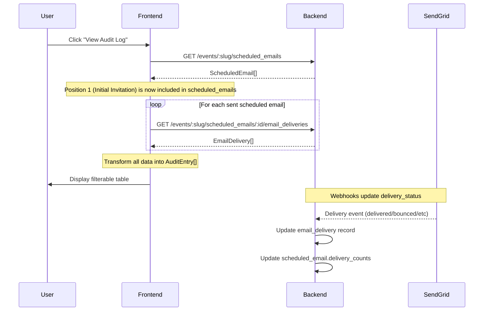

# Email Audit Log - Technical Specification & Backend Coordination

**Status:** ✅ Fully Implemented (Frontend + Backend)
**Version:** 1.1
**Last Updated:** April 8, 2026
**Related Docs:**
- [FRONTEND_UPDATE_2025-02-27.md](./FRONTEND_UPDATE_2025-02-27.md) - Implementation details and known issues
- [EMAIL_HISTORY_AUDIT.md](./EMAIL_HISTORY_AUDIT.md) - Original requirements

---

## Table of Contents

1. [Overview](#overview)
2. [System Architecture](#system-architecture)
3. [Data Flow](#data-flow)
4. [Backend API Requirements](#backend-api-requirements)
5. [Data Models](#data-models)
6. [Critical Backend Coordination Points](#critical-backend-coordination-points)
7. [Known Issues Requiring Backend Fixes](#known-issues-requiring-backend-fixes)
8. [Testing & Validation](#testing--validation)

---

## Overview

The Email Audit Log is a **full-screen, filterable, sortable email tracking dashboard** that displays all email deliveries for an event. It aggregates data from three sources:

1. **Scheduled Emails** - Automated emails (application confirmations, reminders, etc.)
2. **Email Deliveries** - Individual delivery records with SendGrid webhook status
3. **Event Invitations** - Invitation emails sent to vendors

### Key Features Implemented

✅ **9-column sortable table** with delivery details
✅ **Advanced filtering** - Email name, category, status, text search
✅ **Deep linking** - Click undelivered/unsubscribed counts to filter view
✅ **Pagination** - 100 items per page
✅ **Status-based action menus** - Context-aware actions per delivery status
✅ **Contact Support integration** - Discord webhook for support requests
✅ **Auto-refresh** - 30-second polling for delivery stats updates

### Entry Points

Users can open the Email Audit Log from three places:

1. **Global "View Audit Log" button** → Shows all emails
2. **Recipients count button** → Filters by email name
3. **Undelivered/Unsubscribed counts** → Filters by email name + status

---

## System Architecture

### Component Hierarchy

```
EmailAutomationTab (Mail Tab)
├── State Management
│   ├── Emails list (all scheduled emails from database)
│   ├── Audit log overlay state
│   └── Auto-refresh timer (30s)
├── EmailTable
│   └── EmailRow (per email)
│       ├── Recipients button → Opens audit log (ALL emails)
│       ├── Undelivered count → Deep link to audit log
│       ├── Unsubscribed count → Deep link to audit log
│       └── Action menu (ALL emails)
└── EmailAuditLogOverlay ← FULL-SCREEN OVERLAY
    ├── EmailAuditFilters (Search + 3 dropdowns)
    ├── EmailAuditTable (9 columns)
    │   └── EmailAuditActionMenu (Per-row actions)
    └── ContactSupportDialog (Discord webhook)
```

### ~~Virtual Invitation Email~~ **DEPRECATED** (Feb 28, 2026)

**Old System (Removed):**
The frontend used to create a virtual `ScheduledEmail` object with `id: -1` to represent invitations. This caused duplicate rows and inconsistent behavior.

**New System (Current):**
- **Position 1** ("Initial Invitation") is now a **real `ScheduledEmail`** from the database
- Backend uses Position 1 template for sending invitation emails
- No special flags or virtual emails needed
- Position 1 behaves like any other scheduled email (editable, full action menu)

**See:** [INVITATION_UNIFICATION_FRONTEND_UPDATE.md](./INVITATION_UNIFICATION_FRONTEND_UPDATE.md) for details

---

## Data Flow

### Loading Email Audit Log



### Data Transformation

**Backend Data:**
```typescript
ScheduledEmail {
  id: 123,
  name: "Application Confirmation",
  status: "sent",
  delivery_counts: {
    total_sent: 50,
    delivered: 45,
    bounced: 3,
    dropped: 2
  }
}

EmailDelivery {
  id: 456,
  scheduled_email_id: 123,
  registration_id: 789,
  recipient_email: "vendor@example.com",
  status: "delivered",
  sent_at: "2026-02-27T10:00:00Z"
}
```

**Frontend Transformation:**
```typescript
AuditEntry {
  id: "123-789",                    // Composite key
  sent_at: "2026-02-27T10:00:00Z",
  recipient_email: "vendor@example.com",
  recipient_name: "John Doe",       // TODO: From registration
  email_name: "Application Confirmation",
  email_subject: "Your application for {{event_title}}",
  trigger_type: "on_application_submit",
  category: "Food & Beverage",      // TODO: From registration
  status: "delivered",
  scheduled_email_id: 123,
  registration_id: 789
}
```

---

## Backend API Requirements

### Required Endpoints

#### 1. Get Scheduled Emails for Event
```
GET /api/v1/presents/events/:event_slug/scheduled_emails
```

**Response:**
```typescript
ScheduledEmail[] {
  id: number
  name: string
  subject_template: string
  trigger_type: TriggerType
  status: 'scheduled' | 'paused' | 'sent' | 'failed'
  sent_at: string | null
  recipient_count: number

  // CRITICAL: Aggregated delivery counts
  delivery_counts?: {
    total_sent: number
    delivered: number
    bounced: number
    dropped: number
    unsubscribed: number
    pending: number
  }

  // CRITICAL: Individual metrics
  undelivered_count?: number      // bounced + dropped
  unsubscribed_count?: number
  delivered_count?: number
}
```

**⚠️ CRITICAL:** `delivery_counts` and individual metrics must be **accurate aggregations** of the `email_deliveries` table. Discrepancies cause Issue #4 (see Known Issues).

---

#### 2. Get Email Deliveries for Scheduled Email
```
GET /api/v1/presents/events/:event_slug/scheduled_emails/:id/email_deliveries
```

**Response:**
```typescript
EmailDelivery[] {
  id: number
  scheduled_email_id: number
  registration_id: number
  recipient_email: string
  status: DeliveryStatus
  bounce_reason: string | null
  drop_reason: string | null
  sent_at: string | null
  delivered_at: string | null
  unsubscribed_at: string | null
}
```

**Note:** This is called **for each sent email** to build the audit log. Performance optimization: Consider a bulk endpoint that returns all deliveries for an event.

---

#### 3. Get Recipients for Scheduled Email
```
GET /api/v1/presents/events/:event_slug/scheduled_emails/:id/recipients
```

**Used for:** Scheduled/paused emails to show who **will receive** the email.

**Response:**
```typescript
{
  count: number
  category: string                  // Category filter applied
  email_type: 'invitation_reminders' | 'registration_emails'
  recipients: Array<{
    email: string
    name: string
    organization: string
  }>
}
```

**✅ FIXED (April 8, 2026):** Backend now properly filters `recipients` array to exclude dropped/hard-bounced emails, ensuring the array length matches the `count` value. This resolved the recipient count mismatch issue where audit log showed 52 recipients when email table showed 45.

---

#### 4. Get Event Invitations (with Delivery Stats)
```
GET /api/v1/presents/events/:event_slug/invitations
```

**Response:**
```typescript
{
  invitations: Array<{
    id: number
    sent_at: string | null
    vendor_contact: {
      name: string
      email: string
      vendor_category: string       // CRITICAL: Used for category badge
    }
    delivery_status?: DeliveryStatus // CRITICAL: Current delivery status
  }>

  meta: {
    total_count: number
    sent_count: number

    // CRITICAL: Delivery stats for virtual email
    delivery_stats?: {
      total_sent: number
      delivered: number
      bounced: number
      dropped: number
      unsubscribed: number
      pending: number
      undelivered: number             // bounced + dropped
    }
  }
}
```

**⚠️ CRITICAL:** `delivery_stats` must match the individual invitation `delivery_status` values to avoid Issue #4.

---

#### 5. Retry Failed Deliveries
```
POST /api/v1/presents/events/:event_slug/scheduled_emails/:id/retry_failed
```

**Behavior:**
- Retry only **soft bounces** (temporary failures like "mailbox full")
- Skip **hard bounces** (permanent failures like "invalid email")

**Response:**
```typescript
{
  message: string
  retried_count: number
  skipped_count: number
  total_failed: number
}
```

---

### Optional Endpoints (Future Enhancement)

#### Bulk Email Deliveries Endpoint
```
GET /api/v1/presents/events/:event_slug/email_deliveries
```

**Purpose:** Reduce N+1 queries by fetching all deliveries in one call.

**Query Params:**
- `scheduled_email_ids[]` - Filter by email IDs
- `status` - Filter by delivery status

---

## Data Models

### Core Types (TypeScript)

```typescript
// Email Audit Entry (Frontend representation)
interface AuditEntry {
  id: string                        // "${scheduled_email_id}-${registration_id}"
  sent_at: string | null
  scheduled_for?: string | null     // For scheduled emails
  recipient_name: string | null     // TODO: Fetch from registration
  recipient_email: string
  email_name: string
  email_subject: string
  trigger_type: TriggerType
  category: string                  // TODO: Fetch from registration.vendor_category
  status: DeliveryStatus
  bounce_reason?: string | null
  drop_reason?: string | null
  unsubscribed_at?: string | null
  scheduled_email_id: number
  registration_id: number
}

// Audit Filters
interface AuditFilters {
  email_name?: string               // Exact match
  status?: DeliveryStatus | 'undelivered'  // 'undelivered' = bounced + dropped
  category?: string                 // Vendor category
  search?: string                   // Search name or email (case-insensitive)
}

// Delivery Status
type DeliveryStatus =
  | 'scheduled'    // Will be sent in future
  | 'pending'      // Sent to SendGrid, awaiting delivery
  | 'queued'       // In SendGrid queue
  | 'sent'         // Left SendGrid successfully
  | 'delivered'    // Successfully delivered to inbox ✅
  | 'bounced'      // Failed - invalid email or mailbox full ❌
  | 'dropped'      // Failed - spam, unsubscribed, etc ❌
  | 'unsubscribed' // User unsubscribed
```

### Backend Models (Rails)

```ruby
# scheduled_emails table
class ScheduledEmail < ApplicationRecord
  belongs_to :event
  has_many :email_deliveries

  # Aggregated delivery stats (calculated from email_deliveries)
  # CRITICAL: Must match email_deliveries.status counts
  jsonb :delivery_counts, default: {
    total_sent: 0,
    delivered: 0,
    bounced: 0,
    dropped: 0,
    unsubscribed: 0,
    pending: 0
  }

  # Computed fields (should match delivery_counts)
  integer :recipient_count
  integer :undelivered_count      # bounced + dropped
  integer :unsubscribed_count
  integer :delivered_count
end

# email_deliveries table
class EmailDelivery < ApplicationRecord
  belongs_to :scheduled_email
  belongs_to :registration

  # Updated via SendGrid webhooks
  enum status: {
    scheduled: 0,
    pending: 1,
    queued: 2,
    sent: 3,
    delivered: 4,
    bounced: 5,
    dropped: 6,
    unsubscribed: 7
  }

  string :bounce_reason
  string :drop_reason
  datetime :sent_at
  datetime :delivered_at
  datetime :bounced_at
  datetime :dropped_at
  datetime :unsubscribed_at
end

# event_invitations table
class EventInvitation < ApplicationRecord
  belongs_to :event
  belongs_to :vendor_contact

  # Delivery status (updated via SendGrid webhooks)
  enum delivery_status: DeliveryStatus

  datetime :sent_at
end
```

---

## Critical Backend Coordination Points

### 1. SendGrid Webhook Processing ⚠️ CRITICAL

**Requirement:** Webhooks **MUST update both tables** to maintain data consistency:

```ruby
# SendGrid webhook handler (pseudo-code)
class SendGridWebhookController < ApplicationController
  def process_event
    event = params[:event]  # 'delivered', 'bounced', 'dropped', etc.
    message_id = params[:sg_message_id]

    # Find delivery record
    delivery = EmailDelivery.find_by(sendgrid_message_id: message_id)

    # 1. Update email_delivery record
    delivery.update!(
      status: event,
      delivered_at: (event == 'delivered' ? Time.now : nil),
      bounced_at: (event == 'bounced' ? Time.now : nil),
      bounce_reason: params[:reason],
      drop_reason: params[:reason]
    )

    # 2. Update aggregated counts on scheduled_email
    scheduled_email = delivery.scheduled_email
    scheduled_email.recalculate_delivery_counts!  # CRITICAL METHOD
  end
end

# ScheduledEmail model
class ScheduledEmail < ApplicationRecord
  def recalculate_delivery_counts!
    counts = email_deliveries.group(:status).count

    self.delivery_counts = {
      total_sent: email_deliveries.count,
      delivered: counts['delivered'] || 0,
      bounced: counts['bounced'] || 0,
      dropped: counts['dropped'] || 0,
      unsubscribed: counts['unsubscribed'] || 0,
      pending: counts['pending'] || 0
    }

    self.delivered_count = delivery_counts[:delivered]
    self.undelivered_count = delivery_counts[:bounced] + delivery_counts[:dropped]
    self.unsubscribed_count = delivery_counts[:unsubscribed]

    save!
  end
end
```

**Why this matters:**
- Mail Tab displays `scheduled_email.delivery_counts`
- Audit Log displays individual `email_deliveries.status`
- **If these don't match → Issue #4 (data discrepancy)**

---

### 2. Invitation Delivery Stats

**Requirement:** The `/events/:slug/invitations` endpoint must include aggregated delivery stats:

```ruby
class EventInvitationsController < ApplicationController
  def index
    invitations = @event.event_invitations.includes(:vendor_contact)

    # Calculate delivery stats
    sent_invitations = invitations.where.not(sent_at: nil)
    delivery_stats = sent_invitations.group(:delivery_status).count

    render json: {
      invitations: invitations.as_json(include: :vendor_contact),
      meta: {
        total_count: invitations.count,
        sent_count: sent_invitations.count,

        # CRITICAL: Frontend uses this for virtual email
        delivery_stats: {
          total_sent: sent_invitations.count,
          delivered: delivery_stats['delivered'] || 0,
          bounced: delivery_stats['bounced'] || 0,
          dropped: delivery_stats['dropped'] || 0,
          unsubscribed: delivery_stats['unsubscribed'] || 0,
          pending: delivery_stats['pending'] || 0,
          undelivered: (delivery_stats['bounced'] || 0) + (delivery_stats['dropped'] || 0)
        }
      }
    }
  end
end
```

---

### 3. Missing Data: Recipient Name & Category

**Current Issue:** Audit log shows "Unknown" for recipient name and category.

**Root Cause:** `EmailDelivery` doesn't include `registration` data.

**Solution:** Include registration data in delivery response:

```ruby
class EmailDeliveriesController < ApplicationController
  def index
    deliveries = @scheduled_email.email_deliveries.includes(registration: :vendor_contact)

    render json: deliveries.as_json(
      include: {
        registration: {
          only: [:id],
          include: {
            vendor_contact: {
              only: [:name, :email],
              methods: [:vendor_category]  # CRITICAL: For category badge
            }
          }
        }
      }
    )
  end
end
```

**Frontend Update Required:**
```typescript
// EmailAuditLogOverlay.tsx:112-128
for (const delivery of deliveries) {
  entries.push({
    id: `${email.id}-${delivery.registration_id}`,
    sent_at: delivery.sent_at,
    recipient_name: delivery.registration?.vendor_contact?.name || null,  // ✅ Fixed
    recipient_email: delivery.recipient_email,
    email_name: email.name,
    email_subject: email.subject_template,
    trigger_type: email.trigger_type,
    category: delivery.registration?.vendor_contact?.vendor_category || 'Unknown',  // ✅ Fixed
    status: delivery.status,
    // ... rest of fields
  });
}
```

---

### 4. Auto-Refresh Performance

**Current Behavior:** Frontend polls every 30 seconds:

```typescript
// EmailAutomationTab.tsx:68-77
useEffect(() => {
  if (!autoRefresh) return;

  const interval = setInterval(() => {
    loadEmails(true);  // Silent refresh
  }, 30000);

  return () => clearInterval(interval);
}, [autoRefresh, eventSlug]);
```

**Backend Impact:**
- `GET /events/:slug/scheduled_emails` called every 30s
- If 10 scheduled emails exist, that's 10 additional API calls for deliveries

**Optimization Recommendation:**
1. Add `include_delivery_counts=true` query param to skip fetching deliveries
2. Or, implement bulk deliveries endpoint to reduce N+1 queries

---

## Known Issues Requiring Backend Fixes

### ~~Issue #4: Delivery Status Discrepancy~~ ✅ **RESOLVED** (April 8, 2026)

**Previous Symptom:**
- Mail Tab showed email recipient count: 45
- Audit Log showed 52 entries for scheduled emails
- Root cause: Recipients API returned `count: 45` but `recipients: [52 items]`

**Root Cause Identified:**
- Backend `scheduled_emails_controller.rb` was missing filtering logic for draft invitation recipients
- The controller excluded registered users from count, but didn't exclude dropped/hard-bounced emails
- This caused a mismatch between the filtered count and the unfiltered recipients array

**Fix Applied:**
1. Added filtering logic to `scheduled_emails_controller.rb` (lines 430-452)
2. Controller now excludes dropped/hard-bounced emails from both count AND recipients array
3. Frontend removed temporary workarounds and uses properly filtered backend data
4. All four filtering paths now complete:
   - RecipientFilterService (registration emails)
   - InvitationReminderService (sent invitation emails)
   - ScheduledEmail.calculate_current_recipient_count (UI counts)
   - ScheduledEmailsController recipients endpoint (scheduled invitation emails)

**Result:**
- ✅ Recipients array length now matches count value
- ✅ Audit log displays accurate recipient lists for scheduled emails
- ✅ No data discrepancy between Mail Tab and Audit Log

---

### ~~Issue #1: Invitation Recipients Button Opens Old Modal~~ ✅ **FIXED** (Feb 28, 2026)

**Status:** ✅ Resolved with invitation system unification

**What Was Fixed:**
- Removed special case for `isInvitationAnnouncement`
- ALL emails now open audit log when clicking recipient count
- Position 1 (Initial Invitation) behaves like any other scheduled email

**Code After Fix:**
```typescript
if (onViewAuditLog) {
  onViewAuditLog({ email_name: email.name });
}
// ✅ No special case needed - all emails use audit log
```

**See:** [INVITATION_UNIFICATION_FRONTEND_UPDATE.md](./INVITATION_UNIFICATION_FRONTEND_UPDATE.md)

---

### Issue #2: Table Headers Don't Scroll

**Location:** `EmailAuditTable.tsx:125-140`

**Fix:** Wrap header and body in single scrollable container:

```tsx
// BEFORE (broken)
<div className="overflow-x-auto">
  <div className="grid ...">Header</div>
</div>
<div className="overflow-x-auto">  {/* Separate scroll container */}
  {entries.map(...)}
</div>

// AFTER (fixed)
<div className="overflow-x-auto">
  <div className="grid ...">Header</div>
  <div>
    {entries.map(...)}
  </div>
</div>
```

**Backend Requirement:** None - this is frontend-only.

---

### Issue #3: UI Density & Pagination

**Current:** 100 items per page, cramped filters

**Proposed:**
- Increase to 150-200 items per page
- Reduce filter padding/spacing
- Add CSS zoom or transform scale

**Backend Requirement:** None - this is frontend-only.

---

## Testing & Validation

### Frontend Tests

**Audit Log Loading:**
```typescript
test('loads audit log with all emails', async () => {
  const { getByText } = render(<EmailAuditLogOverlay event={mockEvent} />);

  await waitFor(() => {
    expect(getByText('Application Confirmation')).toBeInTheDocument();
    expect(getByText('Event Announcement (Invitation)')).toBeInTheDocument();
  });
});
```

**Deep Linking:**
```typescript
test('deep links from undelivered count', async () => {
  const onViewAuditLog = jest.fn();

  render(<EmailRow email={mockEmail} onViewAuditLog={onViewAuditLog} />);

  fireEvent.click(screen.getByText('5'));  // Undelivered count

  expect(onViewAuditLog).toHaveBeenCalledWith({
    email_name: mockEmail.name,
    status: 'undelivered'
  });
});
```

---

### Backend Tests

**Webhook Processing:**
```ruby
test "SendGrid webhook updates delivery counts" do
  email = scheduled_emails(:confirmation)
  delivery = email_deliveries(:vendor_123)

  # Simulate webhook
  post sendgrid_webhook_path, params: {
    event: 'delivered',
    sg_message_id: delivery.sendgrid_message_id
  }

  # Check individual record updated
  assert_equal 'delivered', delivery.reload.status

  # Check aggregated counts updated
  email.reload
  assert_equal 1, email.delivery_counts[:delivered]
  assert_equal 1, email.delivered_count
end
```

**Data Consistency:**
```ruby
test "delivery_counts matches email_deliveries" do
  email = scheduled_emails(:confirmation)

  # Calculate expected from email_deliveries
  expected = email.email_deliveries.group(:status).count

  # Compare with delivery_counts
  assert_equal expected[:delivered], email.delivery_counts[:delivered]
  assert_equal expected[:bounced], email.delivery_counts[:bounced]
  assert_equal expected[:dropped], email.delivery_counts[:dropped]
end
```

---

### Integration Tests

**End-to-End Flow:**
```ruby
test "email audit log shows accurate delivery status" do
  # Setup
  event = events(:summer_market)
  email = scheduled_emails(:confirmation)

  # Send email
  post send_now_path(event.slug, email.id)

  # Simulate webhook (delivered)
  delivery = email.email_deliveries.first
  post sendgrid_webhook_path, params: {
    event: 'delivered',
    sg_message_id: delivery.sendgrid_message_id
  }

  # Check Mail Tab API
  get scheduled_emails_path(event.slug)
  json = JSON.parse(response.body)
  email_json = json.find { |e| e['id'] == email.id }
  assert_equal 1, email_json['delivered_count']
  assert_equal 0, email_json['undelivered_count']

  # Check Audit Log API
  get email_deliveries_path(event.slug, email.id)
  deliveries = JSON.parse(response.body)
  assert_equal 'delivered', deliveries.first['status']

  # Verify consistency
  assert_equal email_json['delivered_count'], deliveries.count { |d| d['status'] == 'delivered' }
end
```

---

## Summary

### What Frontend Has Built ✅

- Full-screen audit log overlay with 9-column table
- Advanced filtering (email name, category, status, search)
- Deep linking from email counts
- Sortable columns
- Status-based action menus
- Contact Support dialog (Discord integration)
- Auto-refresh with 30-second polling

### What Backend Has Provided ✅

**Critical (Completed):**
1. ✅ Ensure `delivery_counts` aggregations match `email_deliveries` status counts
2. ✅ Include `delivery_stats` in `/events/:slug/invitations` response
3. ✅ Update both tables on SendGrid webhook events
4. ✅ Filter recipients array in `/recipients` endpoint to exclude dropped/hard-bounced emails
5. 🔧 Include `registration.vendor_contact` in `/email_deliveries` response (pending)

**Frontend (Completed):**
6. ✅ Fix table header scrolling
7. ✅ Remove invitation email special case (unified with Position 1)

**Optional (Future Enhancement):**
8. 💡 Add bulk deliveries endpoint to reduce N+1 queries
9. 💡 Add `include_delivery_counts` param to skip delivery fetches on auto-refresh

### Next Steps

1. ~~**Backend:** Implement `recalculate_delivery_counts!` method~~ ✅ Complete
2. ~~**Backend:** Add filtering to recipients endpoint~~ ✅ Complete
3. ~~**Frontend:** Remove temporary workarounds~~ ✅ Complete
4. ~~**Frontend:** Fix Issue #1 (remove invitation special case)~~ ✅ Complete
5. **Backend:** Include registration data in delivery responses (optional enhancement)
6. **Backend:** Add database tests for delivery count consistency
7. **QA:** Run integration tests to verify data consistency

---

**Questions or Issues?**
Contact: Frontend Team (Courtney + Claude Code)
